# Phase II Output

## TESTING WITH PROVIDED CODE
A code involving 'cid' is given to us in which only core 1 not taking the branch while all other cores take the branch. Now, we will run 3 tests on it. Clearly the core 1's IPC is different and also its registers are different.
```asm=
addi x10 x0 1
add x2 x3 x4
bne cid x10 label 
addi x5 x6 3
label: 
addi x8 x9 3
```

- Without Data Forwarding
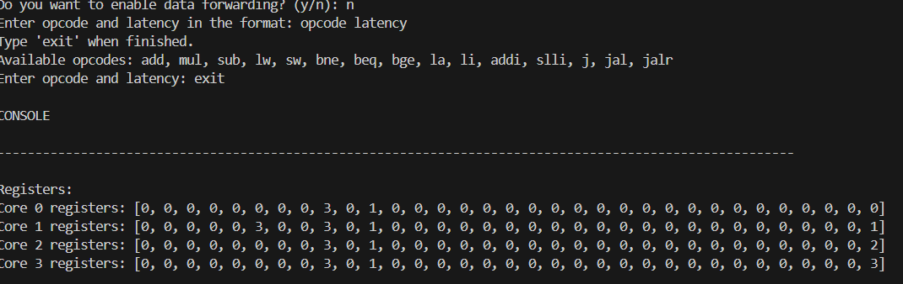
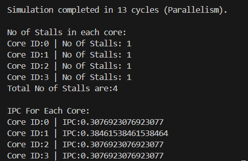

**The No of cycles is 13**

- With Data Forwarding
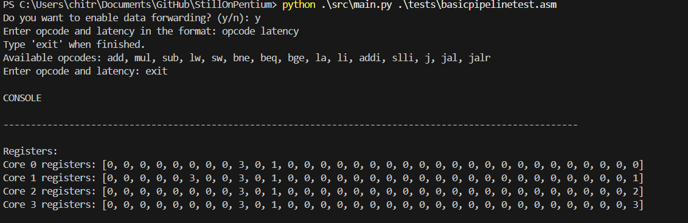 
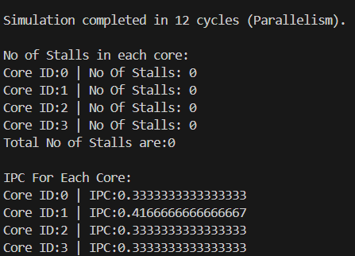

**The No of cycles is 12**

- With Data Forwarding and Added Latency to 'bne'
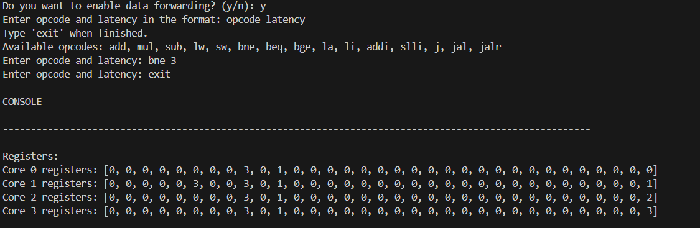
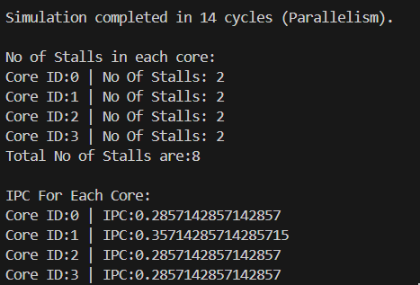

**The No of cycles is 14(+2 added due to latency)**

## Array Sum Problem

Problem Description : We have to store 100 elements in the data, we have to write a code such that core 0 does the sum for the first 25 elements, core 1 does for the next 25 , core 2 for the next and core 3 for the next. All these partial summing has to happen in parallel (this can be achieved by branching and setting up using cid). Finally, only core 0 has to sum up the 4 partial sums and store and print the total sum.

We ran it using Data Forwarding and without Data Forwarding. 

- With DF

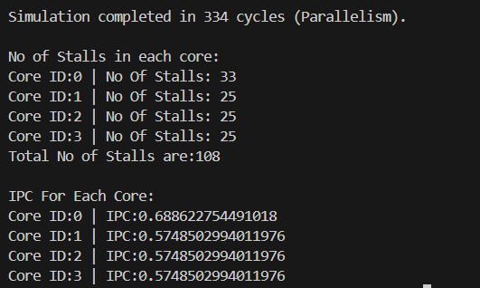

- Without DF
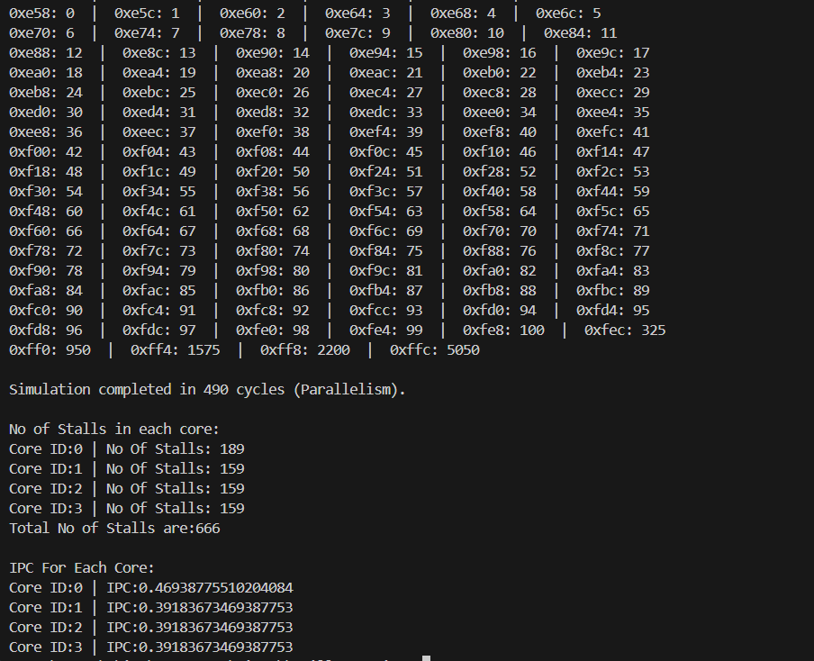
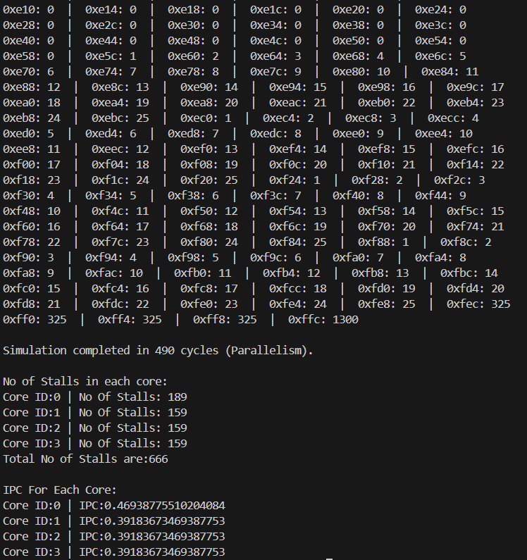

### REGISTERS
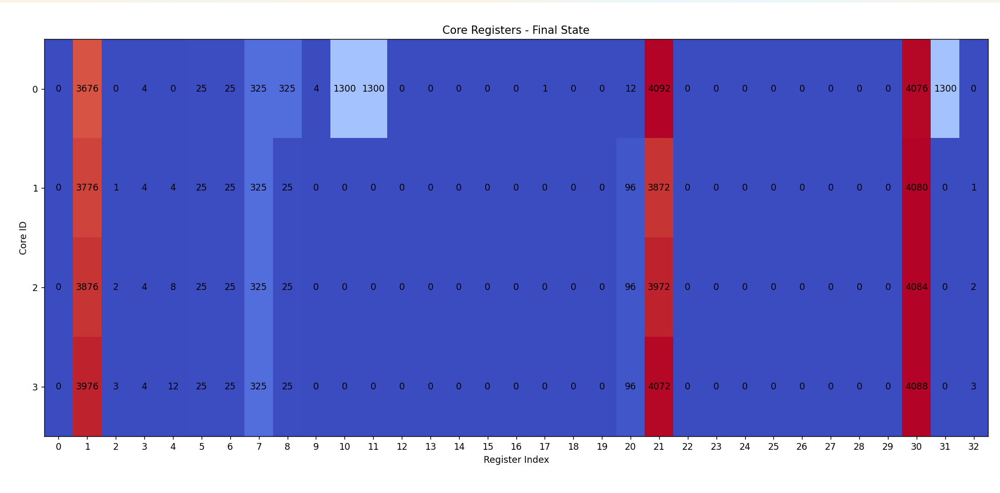

### MEMORY
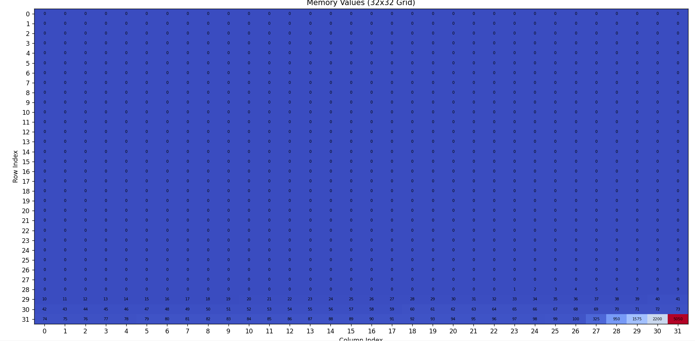
